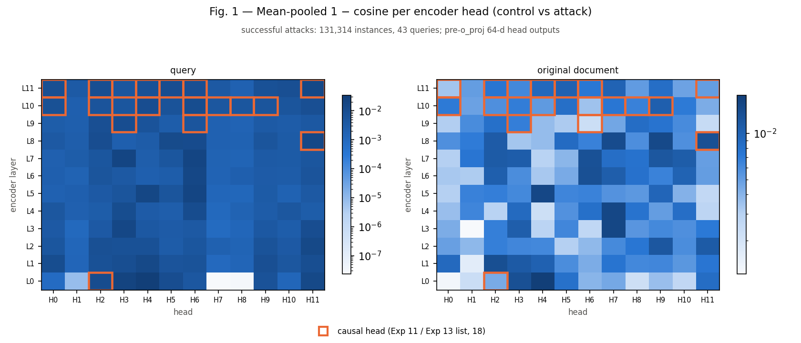
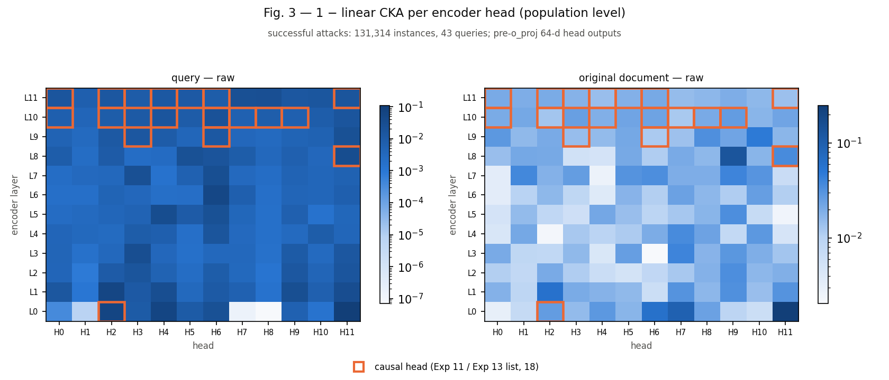
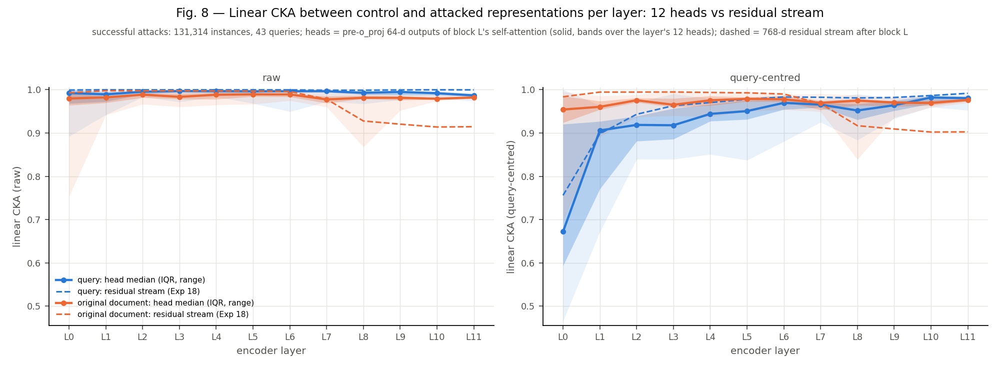
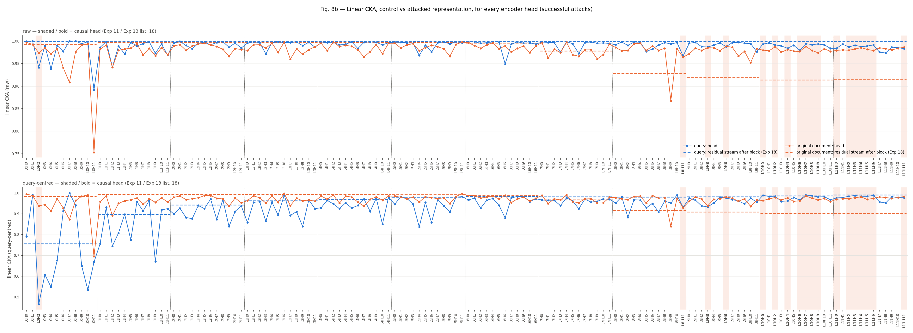
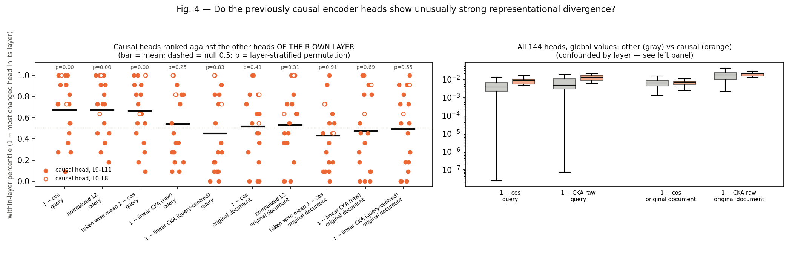

# Experiment 19 — Head-level control → attack representation change

**Question.** Which of the 144 monoT5 encoder self-attention heads change most when attack tokens are inserted? Do those heads overlap with the heads that earlier patching found to be causally important?

**Setup.**
- **Population:** exactly Exp 18's.
  - 422,206 aligned control/attack pairs from 105 attacks, 43 queries and 4,022 qid/docid pairs.
  - The primary analysis uses the 131,314 successful attacks (Δscore > 0).
- **Representation:** the *pre-o_proj head output* (64-d per head), mean-pooled over two regions:
  - `query`;
  - `original document`, which excludes inserted tokens and padding.
- **Metrics:** 1 − cos, normalized L2, token-wise versions of both, and population-level linear CKA (raw and query-centred).
- **Causal heads:** the 18 heads of the Exp 11 / Exp 13 list (Exp 11 canonical effect > 0.02).

This analysis is representational. The causal evidence remains Exp 11 and Exp 13.

**Validation (all passed).**
- Counts equal Exp 18's.
- Scores match to within 4.5e-5.
- Head outputs match the Exp 16 head cache to within 1.5e-6 (cross-checked on all 105 attacks).
- Identical control and attack inputs give exactly 0 change.
- No near-zero control norms.

## Main figures

**Fig. 1 — mean-pooled 1 − cos per head.** Orange boxes mark the causal heads; the colour scale is logarithmic.

**Fig. 3 — 1 − linear CKA per head (raw).** The query-centred version is `fig3b`.

**Fig. 8 / 8b — CKA by layer: the 12 heads vs the residual stream (Exp 18).** Fig. 8b shows every head on the x-axis.

**Fig. 4 — causal heads ranked within their own layer.**

Also in the same folder:
- `fig2`: normalized L2 heatmaps;
- `fig5`: top-20 heads;
- `fig6`: the L6–L11 strip plot;
- `fig7`: success contrast and ρ with Δscore.

## Answers

In the lists below, `*` marks a causal head. All values are for successful attacks unless stated otherwise.

**1. Which heads change the query most?**
- Top 10 by 1 − cos: L0H4, L0H3, L7H3, L5H6, L7H6, L5H4, L6H6, L3H3, L8H11\*, L11H11\*. Normalized L2 gives nearly the same list.
- The absolute changes are small. The median head has 1 − cos ≈ 4e-3, and the largest (L0H4) is 0.034.
- Two L0 heads (L0H7, L0H8) are essentially unchanged (1 − cos ≈ 2e-8).

**2. Which heads change the original document most?**
- Top 10 by 1 − cos: L0H4, L3H7, L4H7, L5H4, L8H9, L8H7, L1H2, L0H3, L8H11\*, L6H6.
- The token-wise metrics shift the ranking toward late heads: L10H10, L11H9, L10H8\*, L8H7, L8H11\*.

**3. Which layers are these heads in?**
- For the mean-pooled metrics they are spread across L0–L8, not concentrated late.
  - Among the top 18 by query 1 − cos, there are 4 heads in L0, 3 in L8 and only 1 in L11.
  - Among the top 18 by document 1 − cos, none are in L9–L11.
- L0H4 is the most changed head in every mean-pooled ranking. It is not causal (Exp 11 rank 35 of 144).
- Only document token-wise normalized L2 concentrates late, with 15 of its top 18 heads in L8–L11.

**4. Is the L7→L8 CKA transition broad or sparse?**

At the head level there is no clear transition (Fig. 8).

| document CKA (raw) | L6 | L7 | L8 | L9 | L11 |
|---|---|---|---|---|---|
| residual stream (Exp 18) | 0.996 | 0.978 | **0.928** | 0.920 | 0.914 |
| head median | 0.989 | 0.977 | 0.981 | 0.981 | 0.982 |
| lowest head | 0.975 | 0.960 | **0.868 (L8H9)** | 0.952 | 0.979 |

- **L7:** there is a mild dip across many heads (6 heads above 2× the L6 median 1 − CKA).
- **L8:** a single head, L8H9, carries 41% of the layer's 1 − CKA. No other head approaches the residual stream's drop.
- **Interpretation:** the residual-stream reorganisation is not a sum of individually reorganised heads. It presumably comes from how the heads are combined (through o_proj, the MLP and the residual accumulation), plus possibly L8H9. This experiment can't separate those contributions.
- **Query:** raw 1 − CKA rises broadly over L10–L11 (11 of 12 L11 heads exceed 2× the L6 median). That is a broad change, not a sparse one.

**5. Do the causal heads diverge unusually strongly?**

Only moderately, and only in the query region. The test ranks each causal head against the other heads of its own layer, where 0.5 is the null.

| metric (query) | mean within-layer percentile of causal heads | layer-stratified p |
|---|---|---|
| 1 − cos | 0.67 (CI 0.65–0.69) | 0.001 |
| normalized L2 | 0.67 | 0.001 |
| token-wise 1 − cos | 0.66 | 0.002 |
| 1 − CKA raw / query-centred | 0.54 / 0.45 | 0.25 / 0.83 |

- Restricted to L9–L11: 0.65, p = 0.004.
- Rank correlation with the continuous Exp 11 effect: ρ = 0.34 over all 144 heads, 0.49 within L9–L11.
- **Original document:** no difference from other heads (percentile 0.43–0.53, all p > 0.3).

**6. How much do the top divergent heads overlap with the causal heads?**
- The overlap is about what chance predicts.
  - Top 5 / 10 / 18 by query 1 − cos contain 0 / 2 / 3 causal heads, against 0.6 / 1.25 / 2.25 expected.
  - The document region gives 0 / 1 / 1.
- The only enrichment is document token-wise L2 (6 of the top 18, p = 0.01). That is a global ranking, so late layers are favoured and it is confounded by layer.
- Several of the most divergent heads work against the attack in Exp 11: L8H9 (effect −0.10, rank 120), L8H6 (−0.23, rank 136) and L5H6 (−0.05).
- L8H11 is the only causal head that appears consistently among the most divergent (Exp 11 rank 9; also the top edge head in Exp 15).
- **Overall:** this is outcome 2 from the spec. Many heads diverge, and the causal subset stands out only modestly, and only for the query.

**7. Do successful and unsuccessful attacks differ?**
- Barely. The within-configuration standardised difference is |d| ≤ 0.21 (median 0.03–0.07).
- The direction is consistent across attack configurations, though:
  - **Document:** the late causal heads (L11H0\*, L11H4\*, L11H6\*, L10H7\*, plus L11H7) change slightly *less* when the attack succeeds. Successful attacks change more in only 5–21% of configurations.
  - **Query:** L8H6, L5H6, L8H11\* and L10H6\* change slightly more when the attack succeeds (in 67–83% of configurations), while L11H6\*, L11H5\* and L11H2\* change less.

**8. Do relevant and non-relevant base documents differ?**
- Non-relevant bases change more:
  - document 1 − cos about 1.21× (in 97% of heads);
  - query 1 − cos about 1.11× (in 84% of heads).
- Raw CKA shows 1.5×, but query-centred CKA reverses the direction (0.92–0.97×). So the raw-CKA difference comes from between-query structure.
- Document length is a plausible confound: a longer document dilutes the insertion. This hasn't been tested (see 11).

**9. Does head-level change correlate with Δscore?**
- Yes, V-shaped, as in Exp 18: the change tracks |Δscore|, not success as such.
- **Successful attacks:** the within-configuration Spearman median is +0.40 (query) and +0.36 (document). For 93% of heads the per-query ρ is positive in all 43 queries.
- **Unsuccessful attacks:** the sign flips (median −0.09; −0.25 to −0.34 for L11 causal heads). For 92% of heads the per-query ρ is negative in all 43 queries.
- The late causal heads show the strongest coupling. L11H11\* reaches ρ = +0.64 to +0.66, and the causal-head median is +0.51 vs +0.40 overall (query).
- This is the clearest link between representational change and the causal heads: how much they change tracks how far the score moves, in either direction.

**10. Do cosine, L2 and CKA pick the same heads?**
- **Query:** 1 − cos, L2 and the token-wise metrics agree closely (rank ρ 0.93–0.98; 15–16 of their top 18 heads overlap). Raw CKA partly agrees (ρ 0.85, 12 of 18). Query-centred CKA picks different heads (ρ 0.06–0.26, 5 of 18), dominated by L0–L1.
- **Document:** 1 − cos and L2 agree (ρ 0.97). Token-wise metrics (ρ 0.68–0.75, 7–9 of 18) and CKA (ρ 0.54–0.61) pick different heads.
- So for the document, "which heads change most" depends on the metric.

**11. Confounds and implementation concerns**
- **Layer confound.** Change magnitude differs by layer, and 16 of the 18 causal heads are in L8–L11. The within-layer test is the valid comparison; global top-k enrichment is descriptive only.
- **Layer alignment in Fig. 8.** "Layer L" means the heads *inside* block L but the residual stream *after* block L. This is the natural pairing, but they are not the same point in the network.
- **Different example sets.** The causal effects come from Exp 11's canonical attack on 100 examples, not from this population.
- **Small effects.** Pooled changes are small (1 − cos around 1e-3 to 1e-2), and the success contrasts are smaller still (|d| ≤ 0.2).
- **Relevance vs length.** The relevance difference (Q8) may be a document-length effect; this is untested.
- **Query-centred CKA in L0–L1.** It is very low for some query heads (L0H2\* at 0.47). Once query identity is removed, the remaining variance is small, so the attack's share of it looks large. It is not a large absolute change.
- **Boundary-shift instances.** 1,270 instances (0.3%) have the known Exp 01 boundary shift. They are included, as in Exp 18.
- **No uncertainty on CKA.** CKA values are descriptive population values without confidence intervals.
- **Deleted per-instance data.** New per-instance analyses need Stage 01 rerun (about 30 min on an L40). All figures can be redrawn from the kept CSVs with `02_analyze_head_change.py --plots-only`.

## Bottom line

Attack insertion perturbs many heads a little, led by early and mid-layer heads (L0H4 above all) that aren't causal. The causal heads stand out only modestly: somewhat more query change than their layer peers. Their change magnitude is the most strongly coupled to how far the score moves, in either direction.

The large L7→L8 geometry change in the residual stream does not appear in individual heads, apart from one non-causal head, L8H9.
